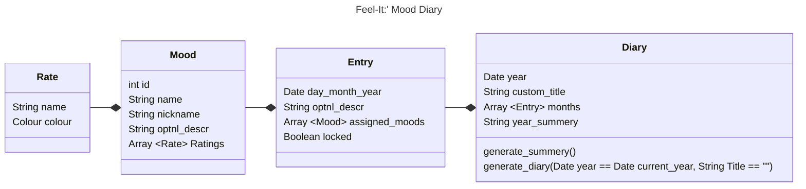

```mermaid

---
title: Feel-It:' Mood Diary
---
classDiagram
    direction RL

    Diary : Date year
    Diary : String custom_title
    Diary : Array ~Entry~ months
    Diary : String year_summery
    Diary : generate_summery()
    Diary : generate_diary(Date year == Date current_year, String Title == "")

    Entry : Date day_month_year
    Entry : String optnl_descr
    Entry : Array ~Mood~ assigned_moods
    Entry : Boolean locked

    Mood : int id
    Mood : String name
    Mood : String nickname
    Mood : String optnl_descr
    Mood : Array ~Rate~ Ratings

    Rate : String name
    Rate : Colour colour

    Mood *-- Rate

    Entry *-- Mood

    Diary *-- Entry
    

    
```
