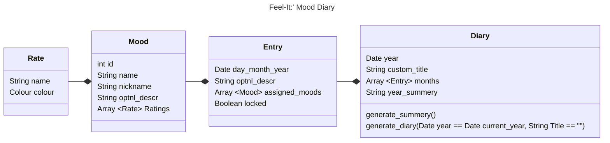

# Feel-It: Mood Diary App

## What it feels like

Feel-It is the way to follow your vibes and track its journey in how it sways up and down.
Simple to use and a joy know how your mind has tresverse though the hardships and bissful eras.

## App Descritpion

Users are able to swiftly, and without hinderrance, record their energy, moods and how well they have acoomplished daily/weekly/monthly personal goals.

The app should be cross platform and feel efortless to view and record data.

Entries are quries prompted to users where users record a rating from 0 - x for any speifc rating.

Addtionly some entries can be long text to more decicvly note events that happened that day or more idepthly describe how the day went.

Data needs to need a thrid party cloud sever of the users hooosing such as google drive, onedrive, etc.

## Funcitonal requirments

| FR## | Description                                                                  |
|------|------------------------------------------------------------------------------|
| FR01 | Users can manage entries                                                     |
| FR02 | The view must be graphically pleasant and intuitive to understand            |
| FR03 | UI must be minimal with as few extra menues as possiable                     |
| FR04 | Their must be a UI for types of entries                                      |
| FR05 | Default entries must include energy and mood                                 |
| FR06 | Each indvidual day must include all allocated entries                        |
| FR07 | Feel boards consist of a year have a title and optional description          |
| FR08 | Optin to lock entries s that after the day entries ccan noo longer be edited |

## ClassDiagram

[ClassDiagram.md](ClassDiagram.md)

